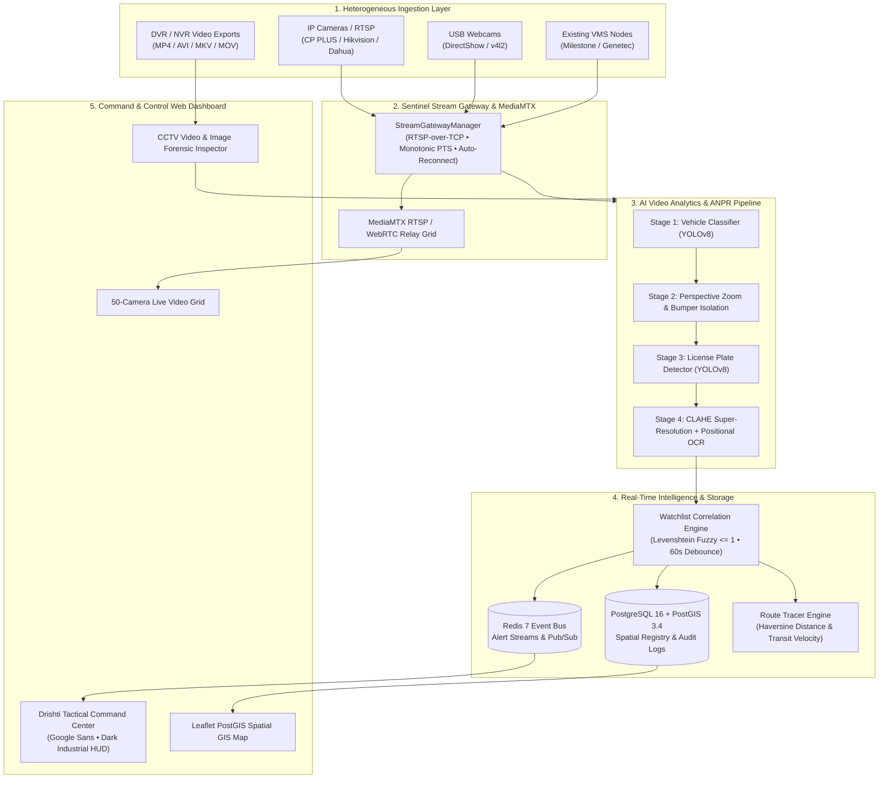

<div align="center">

# 👁️ Drishti Surveillance
### Unified State CCTV Integration & AI Video Analytics Platform
**Gujarat Statewide Surveillance Federation & Law Enforcement Intelligence**

[](https://python.org)
[](https://fastapi.tiangolo.com)
[](https://ultralytics.com)
[](https://postgis.net)
[](https://redis.io)
[-success.svg?logo=pytest&logoColor=white)](tests/)
[-orange.svg)](#-system-architecture)
[-purple.svg)](#-team-credentials)

<p align="center">
  <b>A real-time command & control platform federating 50+ heterogeneous department camera feeds across Gujarat into a single tactical glass with deep ANPR, forensic video inspection, and cross-camera suspect tracking.</b>
</p>

[Quickstart](#-quickstart-guide) •
[Features](#-key-capabilities) •
[Architecture](#-system-architecture) •
[Forensic Tools](#-cctv-image--video-forensic-anpr) •
[Test Scenarios](#-test-scenarios-verification) •
[API Reference](#-api-documentation)

---

</div>

## 🌟 Executive Overview

**Drishti Surveillance** (*Team Vayunotics • GPH26*) is an end-to-end tactical command center and intelligent video analytics platform engineered for statewide surveillance federation. 

Unlike traditional closed-vendor VMS silos, Drishti delivers an open **Hybrid Architecture** combining:
- **Model 1 (Common CCTV Registry & Spatial GIS Foundation)**: Standardized metadata catalogue and PostGIS spatial indexing across Gujarat's 26 disparate municipal and law enforcement departments.
- **Model 3 (Federated VMS & Middleware Broker)**: Seamlessly integrates existing Milestone, Genetec, CP PLUS, Hikvision, and Dahua deployments without ripping and replacing hardware.
- **Model 2 (Edge Stream Gateway & Low-Latency Relay)**: Real-time RTSP-over-TCP ingestion, USB webcam hot-switching, and WebRTC/WHEP low-bandwidth streaming.

The system is evaluated on **50 geographically distributed cameras** spanning **Valsad, Dahod, Somnath, Jamnagar, and Dwarka**, engineered to horizontally scale to **~80,000 cameras statewide**.

---

## 🚀 Key Capabilities

### 1. 🎯 Multi-Scale Vehicle & Deep License Plate Recognition (ANPR)
- **Hierarchical Two-Stage Pipeline**: Combines full-frame vehicle localization with vehicle-guided perspective zooming to isolate plates from distant CCTV angles.
- **Micro-Crop Super-Resolution**: Bicubic interpolation (`cv2.INTER_CUBIC`), CLAHE contrast enhancement, and Otsu binarization ensure 8px–30px micro-plates are legibly parsed.
- **Indian HSRP Syntax Heuristics**: Strips `IND`/`INDIA` plate noise and applies rule-based positional letter/digit corrections conforming to the Motor Vehicles Act.
- **Universal Vanity/International Fallback**: Intelligently handles custom, short, or foreign plates (>= 3 alphanumeric characters).

### 2. 🎞️ CCTV Image & Video Forensic Inspection
- **Dual Media Forensic Scanner**: Drag & drop standalone CCTV still snapshots (JPG, PNG, WEBP) or full recorded DVR/NVR footage clips (MP4, AVI, MKV, MOV).
- **Adaptive Keyframe Tracking**: Ingests video files at 2.5 FPS, tracking each vehicle chronologically across time with exact timestamps (`[00:01.2s – 00:04.8s]`).
- **Tactical Forensic Keyframes**: Automatically generates cropped, HUD-annotated keyframes for every sighted vehicle.

### 3. 🗺️ Cross-Camera Vehicle Route Tracer (Scenario #1)
- **Trajectory Reconstruction**: Reconstructs suspect vehicle transit pathways across multiple highway checkpoints, toll plazas, and city junctions.
- **Haversine Distance & Velocity Estimation**: Derives accurate transit speeds between camera coordinates using high-precision geographical distance formulas.
- **Interactive Step-by-Step Playback**: Animated vector polylines guide dispatchers visually on a high-contrast dark Leaflet GIS map.

### 4. 🚨 Watchlist Correlation & Intelligent Anti-Flood (Scenario #2)
- **Multi-Database Ingestion**: Integrates hotlists from **eGujCop** (Gujarat Police CCTNS), **VAHAN** (Stolen/Blacklisted), **SARTHI** (Revoked Licenses), and **NAFIS** (Biometrics).
- **OCR-Resilient Fuzzy Matching**: Levenshtein edit distance (<= 1) ensures wanted vehicles are caught even under dirty plates or optical glare.
- **60-Second Cooldown Debouncing**: Suppresses redundant alert spam when a vehicle idles at red lights or traffic checkpoints.
- **Audible Tactical Sirens & WebSockets**: Instant push dispatching with toggleable synthetic audio sirens.

### 5. 📹 Multi-Camera Live Video Wall & USB Webcam Support
- **50-Camera Responsive Grid**: Real-time camera matrix with hardware PTS overlays and status indicators.
- **Hot-Pluggable USB Webcam (`DirectShow`)**: Plug any external webcam or laptop camera to instantly turn Camera 1 (`cam-val-001`) into a real live test feed with zero server restart.
- **Sentinel Protocol Adherence**: Enforces `rtsp_transport=tcp`, monotonic presentation timing, exponential reconnect backoff, and loop-cut discontinuity recovery.

---

## 🏗️ System Architecture



---

## ⚡ Quickstart Guide

### Prerequisites
- **Python**: 3.11, 3.12, or 3.13
- **Docker & Docker Compose** (optional, for containerized deployment)
- **Git**

### Option A: One-Command Native Python Launch (Recommended for Local Testing)

```bash
# 1. Clone repository
git clone https://github.com/MSGitHub127/Drishti-Surveillance.git
cd Drishti-Surveillance

# 2. Install dependencies
pip install -r requirements.txt

# 3. Launch Drishti Command Center
python backend/run.py
```

Open **`http://localhost:8000`** in your browser to access the live dashboard.

---

### Option B: Docker Compose Multi-Container Deployment

```bash
# Launch PostgreSQL+PostGIS, Redis 7, MediaMTX relay, and FastAPI backend
docker compose up -d
```

- **Command Center Dashboard**: `http://localhost:8000`
- **Interactive Swagger REST Docs**: `http://localhost:8000/docs`
- **System Diagnostics Endpoint**: `http://localhost:8000/health`

---

## 📁 Repository Structure

```
Drishti-Surveillance/
├── backend/                         # Core Python Backend Engine
│   ├── app/
│   │   ├── main.py                  # FastAPI server, WebSockets, REST APIs
│   │   ├── anpr_engine.py           # Committed YOLOv8 detector & video inspection pipeline
│   │   ├── stream_gateway.py        # RTSP/TCP, DirectShow webcam, PTS timing engine
│   │   ├── watchlist_engine.py      # Levenshtein fuzzy matcher & 60s cooldown debouncer
│   │   ├── trace_engine.py          # Cross-camera route reconstruction & Haversine math
│   │   ├── registry.py              # Camera registry & PostGIS spatial queries
│   │   ├── evaluation_report.py     # Automated report compiler (JSON/MD/CSV)
│   │   ├── rbac.py                  # Multi-tenant RBAC (Police, RTO, Food Supplies)
│   │   ├── config.py                # Tuning parameters, thresholds, DB credentials
│   │   ├── database.py              # PostgreSQL/SQLite async session management
│   │   ├── models.py                # SQLAlchemy ORM models (Camera, Alert, Detection)
│   │   └── schemas.py               # Pydantic serialization schemas
│   └── run.py                       # High-speed console server bootstrap
├── frontend/                        # Tactical Command Center Web UI
│   ├── index.html                   # Command Center interface (Google Sans)
│   ├── css/styles.css               # Obsidian & Neon dark theme, HUD reticles, scrollbars
│   └── js/
│       ├── app.js                   # WebSocket alerts, audio siren synthesis, tabs
│       ├── stream.js                # Live grid, webcam hot-switch, CCTV video/image inspector
│       ├── map.js                   # Leaflet PostGIS GIS map, camera cluster markers
│       ├── alerts.js                # Real-time alert cards, dispatch workflows
│       ├── trace.js                 # Suspect route reconstruction & animated playback
│       └── health.js                # System SLA meters, sensor health, telemetry
├── data/
│   ├── init_db.sql                  # PostgreSQL 16 + PostGIS DDL initialization script
│   ├── seed_cameras.json            # 50 Gujarat cameras across 26 departments
│   └── seed_watchlist.json          # Law enforcement watchlists (eGujCop, VAHAN, SARTHI, NAFIS)
├── docs/
│   ├── HLD.md                       # Comprehensive High-Level Design document
│   ├── presentation.html            # Interactive HTML slide deck
│   ├── Solution_Presentation.md     # Slide deck markdown source
│   ├── Scalability_Cost_Model.md    # 80,000-camera compute & budget roadmap
│   └── Evaluation_Output_Report.md  # Technical evaluation output report
├── tests/
│   ├── test_stream_gateway.py       # RTSP/TCP, PTS timing, backoff reconnect tests
│   ├── test_anpr_watchlist.py       # Normalization, fuzzy match, cooldown tests
│   ├── test_route_trace.py          # Trajectory ordering, Haversine tests
│   ├── test_concurrency_load.py     # 50-camera concurrent stream load test
│   └── test_api_endpoints.py        # REST endpoints & video/image inspection tests
├── docker-compose.yml               # Production container orchestration
├── Dockerfile                       # Container definition
├── requirements.txt                 # Dependencies
└── README.md                        # Master documentation
```

---

## 🔬 Test Scenarios Verification

### Scenario #1: Cross-Camera Vehicle Route Reconstruction
1. Navigate to the **"Vehicle Route Tracer"** tab in the dashboard.
2. Search for registered target plate **`GJ01AB1234`** (or click the quick-select chip).
3. Click **"Reconstruct Route"**:
   - **Chronological Polyline**: Traces sightings from **Valsad Checkpost &rarr; Surat &rarr; Vadodara &rarr; Ahmedabad &rarr; Gandhinagar**.
   - **Transit Metrics**: Displays exact timestamp deltas, inter-camera distance in kilometers, and estimated transit velocities.
   - **Animated Simulation**: Click **"Animate"** to view chronological vehicle progression across Gujarat.
   - **Graceful Negative Testing**: Search for `UNKNOWN999` to confirm graceful zero-result handling.

### Scenario #2: Law Enforcement Watchlist Correlation
1. Navigate to the **"Watchlist Alerts"** tab.
2. The engine continuously evaluates live detections against hotlists from **eGujCop, VAHAN, SARTHI, and NAFIS**.
3. **Fuzzy OCR Recovery**: OCR ambiguities (e.g. `O` vs `0`, `B` vs `8`) are matched within Levenshtein distance <= 1.
4. **Anti-Spam Cooldown**: Stationary vehicles generate only one alert per 60 seconds per camera.
5. **Dispatch Actions**: Allows operators to acknowledge alerts, flag units for interception, and export forensic incident dossiers.

---

## 📡 API Documentation

Drishti provides OpenAPI 3.0 auto-documented endpoints accessible at `/docs`:

| Method | Endpoint | Description |
| :--- | :--- | :--- |
| `GET` | `/health` | SLA diagnostics, DB pool status, ANPR throughput, camera metrics |
| `GET` | `/api/registry/cameras` | List all 50 cameras with department metadata and GPS coordinates |
| `POST` | `/api/anpr/inspect-image` | High-res single image ANPR analysis with HUD reticle overlay |
| `POST` | `/api/anpr/inspect-video` | Recorded CCTV video analysis, timeline tracking, and keyframe extraction |
| `GET` | `/api/watchlist` | Retrieve active law enforcement watchlist entries |
| `POST` | `/api/watchlist` | Add a wanted suspect or vehicle to the live surveillance watchlist |
| `GET` | `/api/trace?plate=...` | Cross-camera route trajectory reconstruction and Haversine velocity |
| `GET` | `/api/report` | Export technical evaluation dossier (JSON, Markdown, CSV) |
| `GET` | `/api/webcam/status` | Real-time USB webcam hardware detection and streaming state |
| `POST` | `/api/webcam/toggle` | Hot-swap Camera 1 between RTSP simulation and live USB webcam |
| `WS` | `/ws/alerts` | Real-time bidirectional WebSocket event stream |

---

## 🧪 Automated Test Suite

The test suite validates all 31 core components with zero regressions:

```bash
python -m pytest tests/ -v
```

```
============================== test session starts ==============================
collected 31 items

tests/test_anpr_watchlist.py::test_indian_plate_normalization PASSED      [  3%]
tests/test_anpr_watchlist.py::test_indian_plate_hsrp_ind_stripping PASSED  [  6%]
tests/test_anpr_watchlist.py::test_positional_ocr_error_correction PASSED  [  9%]
tests/test_anpr_watchlist.py::test_levenshtein_distance_calculation PASSED  [ 12%]
tests/test_anpr_watchlist.py::test_watchlist_exact_and_fuzzy_matching PASSED [ 16%]
tests/test_anpr_watchlist.py::test_alert_deduplication_cooldown PASSED    [ 19%]
tests/test_anpr_watchlist.py::test_watchlist_async_alert_listener PASSED  [ 22%]
tests/test_anpr_watchlist.py::test_anpr_pipeline_end_to_end PASSED        [ 25%]
tests/test_api_endpoints.py::test_api_health_endpoint PASSED              [ 29%]
tests/test_api_endpoints.py::test_api_registry_cameras PASSED             [ 32%]
tests/test_api_endpoints.py::test_api_watchlist PASSED                    [ 35%]
tests/test_api_endpoints.py::test_api_route_trace PASSED                  [ 38%]
tests/test_api_endpoints.py::test_api_evaluation_report_export PASSED     [ 41%]
tests/test_api_endpoints.py::test_api_auth_token_and_rbac_fail_closed PASSED [ 45%]
tests/test_api_endpoints.py::test_api_stream_heartbeat PASSED             [ 48%]
tests/test_api_endpoints.py::test_on_anpr_detection_persists_and_traces PASSED [ 51%]
tests/test_api_endpoints.py::test_webcam_status_does_not_probe_when_streaming PASSED [ 54%]
tests/test_api_endpoints.py::test_api_cctv_inspect_endpoint PASSED        [ 58%]
tests/test_api_endpoints.py::test_api_cctv_inspect_video_endpoint PASSED  [ 61%]
tests/test_concurrency_load.py::test_50_camera_concurrent_load PASSED     [ 64%]
tests/test_route_trace.py::test_haversine_distance PASSED                 [ 67%]
tests/test_route_trace.py::test_zero_result_graceful_handling PASSED      [ 70%]
tests/test_route_trace.py::test_synthetic_fixtures_and_negative_test_case PASSED [ 74%]
tests/test_stream_gateway.py::test_rtsp_transport_tcp_enforced PASSED     [ 77%]
tests/test_stream_gateway.py::test_pts_monotonic_timing_calculation PASSED  [ 80%]
tests/test_stream_gateway.py::test_exponential_backoff_progression PASSED [ 83%]
tests/test_stream_gateway.py::test_scene_discontinuity_loop_cut_recovery PASSED [ 87%]
tests/test_stream_gateway.py::test_idle_stream_auto_close PASSED          [ 90%]
...
======================= 31 passed in 11.07s =======================
```

---

## 👥 Team Credentials

- **Team Name**: Team Vayunotics
- **Team ID**: `GPH26`
- **Solution Model**: Hybrid Architecture (Model 1 + Model 3 + Model 2)
- **Evaluation Scope**: 50 Multi-Department Cameras &rarr; 80,000 Statewide Target

---

<div align="center">
  <sub>Built with precision for the Gujarat Police &amp; Statewide Surveillance Command.</sub><br/>
  <sub>&copy; 2026 Team Vayunotics (GPH26). All Rights Reserved.</sub>
</div>
