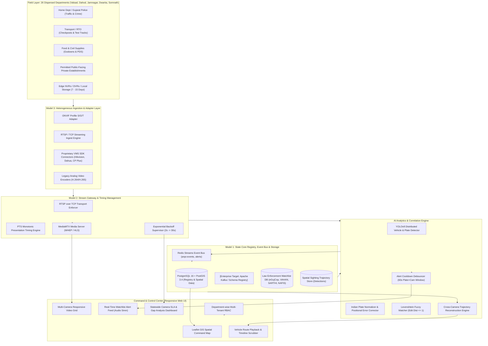
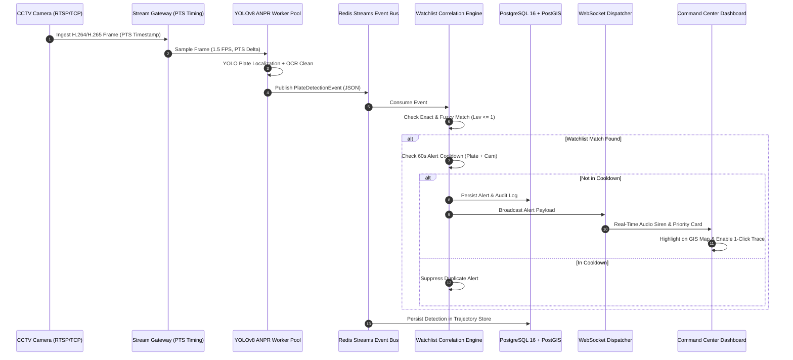
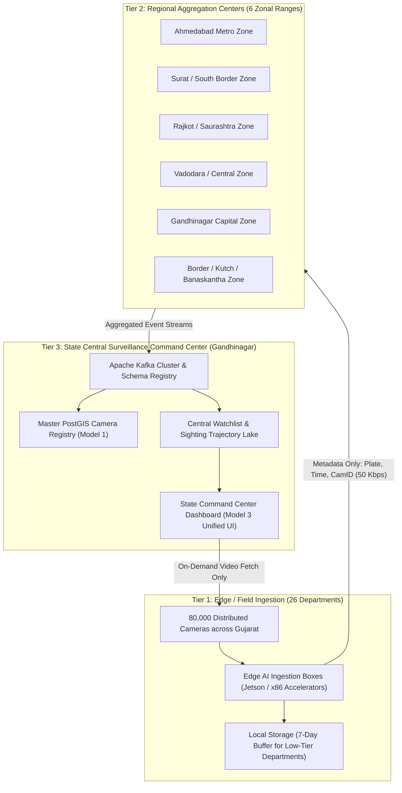

# Unified State CCTV Integration & AI Surveillance Platform
## Technical Proposal — High-Level Design (HLD)
**Project Title**: Statewide Video Surveillance & Law Enforcement Analytics Federation  
**Team**: Team Vayunotics (GPH26)  
**Submission Version**: 2.0.0 (Production Architecture)  
**Target Scale**: Statewide Expansion to ~80,000 Cameras across 26 Government Departments  

---

## 1. Executive Summary & Solution Architecture

### 1.1 Context & Objectives
At present, 26 different Government Departments across the State operate standalone CCTV installations across geographically dispersed sites spanning up to 1,000 kilometers—from border checkposts to industrial corridors in Valsad, Dahod, Somnath, Jamnagar, and Dwarka. These systems represent a heavily fragmented landscape of analog and IP cameras, heterogeneous VMS solutions (Milestone, Genetec, Hikvision, Dahua, CP Plus), varying storage architectures (cloud vs. on-premise NVRs), and divergent retention policies (7 days to 15+ days).

The objective is to unify these disparate cameras into an open, secure, scalable, and vendor-neutral video management and analytics ecosystem. The platform correlates live feeds against mission-critical law enforcement databases (**VAHAN, SARTHI, eGujCop/CCTNS, AFIS, NAFIS**) to trigger automated real-time alerts and reconstruct cross-camera vehicle routes.

### 1.2 Proposed Model: Hybrid Architecture (Model 1 + Model 3 + Model 2 Pattern)
To satisfy the Architecture Principles and avoid vendor lock-in, Team Vayunotics proposes a **Hybrid Architecture** combining:
- **Model 1 — Common CCTV Registry & GIS Foundation** (Mandatory Source of Truth): Central PostGIS spatial registry providing asset visibility, dynamic health monitoring, and administrative governance.
- **Model 3 — VMS Federation & Middleware Event Bus**: Open adapter layer standardizing video/metadata ingestion from multi-vendor VMS instances without requiring wholesale equipment replacement.
- **Model 2 — Stream Gateway & Edge Video Relay**: Direct RTSP-over-TCP ingestion with PTS-anchored monotonic timing, integrated with MediaMTX for low-latency WebRTC (WHEP) and HLS browser playback.



---

## 2. Heterogeneous CCTV, NVR, and VMS Integration Approach

### 2.1 Handling Heterogeneity Without Vendor Lock-In
The state infrastructure encompasses analog cameras, IP cameras, disparate VMS software (Milestone, Genetec, Hikvision, CP Plus, Dahua), varying AMC lifecycle states, and differing communication protocols.

| Layer | Integration Mechanism | Protocol / Standard |
| :--- | :--- | :--- |
| **Modern IP Cameras** | Direct Stream Extraction | ONVIF Profile S (Stream), Profile T (Analytics), RTSP over TCP |
| **Existing VMS Systems** | Modular VMS Adapter Plugins | Vendor REST APIs, RTSP Proxy, Native SDK Connectors |
| **Standalone NVRs/DVRs** | Channel RTSP Multiplexing | Sub-stream RTSP extraction with RTSP-over-TCP fallback |
| **Legacy Analog Systems** | Hardware Video Encoders | 4/8-channel H.264/H.265 IP video encoders with ONVIF compliance |
| **Private Cameras (Malls/Societies)** | Reverse Proxy Gateway | Secure WireGuard/IPsec tunnel or outgoing RTSP relay to avoid public IP requirement |

### 2.2 Standardized Adapter Architecture
To avoid vendor lock-in, the ingestion layer is decoupled using the **Abstract Camera Adapter** pattern. Each vendor-specific driver exposes a uniform interface:
```python
class CameraAdapter(ABC):
    @abstractmethod
    def discover_streams(self) -> List[StreamEndpoint]: ...
    @abstractmethod
    def connect_stream(self, stream_id: str) -> cv2.VideoCapture: ...
    @abstractmethod
    def get_ptz_controls(self) -> Optional[PTZInterface]: ...
    @abstractmethod
    def query_health_status(self) -> CameraHealth: ...
```

---

## 3. Live Stream Ingestion & Processing Architecture

### 3.1 Strict Sentinel Protocol Adherence
Processing video from geographically dispersed sites up to 1,000 km away across public and private networks requires strict adherence to network and timing rules:

1. **Mandatory RTSP over TCP**:
   UDP transport suffers silent packet loss across NAT and corporate firewalls, yielding corrupted macroblocks that cause false detections. All ingest channels strictly enforce `rtsp_transport=tcp`. If port 8554 is blocked by firewalls, fallback to HLS is automatically negotiated.
2. **PTS-Anchored Monotonic Timing Calculation**:
   Cameras and gateway replayers push buffered Groups of Pictures (GOP) on initial connection. Timestamping based on wall-clock frame arrival introduces severe velocity skew in multi-object trackers. All timing is derived from **Presentation Timestamps (PTS)**:
   $$\text{anchor\_wall\_clock} = t_{\text{initial\_connect}}$$
   $$\text{anchor\_pts} = \text{PTS}_{\text{first\_frame}}$$
   $$\tau_{\text{event}}(\text{frame}) = \text{anchor\_wall\_clock} + \frac{\text{PTS}_{\text{frame}} - \text{anchor\_pts}}{1000}$$
   No timing or speed calculation ever relies on declared `CAP_PROP_FPS`.
3. **Resilient Reconnection with Exponential Backoff**:
   Network disconnects trigger automatic reconnection with base backoff $2.0\,\text{s}$, multiplier $1.5\times$, capped at $30.0\,\text{s}$. Tight reconnect loops that flood network infrastructure are strictly prohibited.
4. **Join Decoder Warning Tolerance**:
   Mid-stream attachments on H.264 and H.265 streams frequently produce RPS or missing POC reference warnings until the first IDR keyframe arrives. The decoder logs these warnings without crashing or restarting the pipeline.
5. **Loop-Cut / Scene Discontinuity Recovery**:
   When looped evaluation feeds wrap around, PTS drops backward. The gateway detects this jump ($\Delta \text{PTS} < 0$ or $\Delta \text{PTS} > 3000\,\text{ms}$), re-anchors the PTS timing clock, and flushes transient tracking state smoothly.
6. **On-Demand Capture Pacing & Idle Auto-Close**:
   Streams are ingested only when actively assigned to an analytics task or actively displayed in the control room grid. The stream gateway tracks active viewer connections (`active_viewers`) and automatically releases OpenCV capture handles and RTSP sockets after `STREAM_IDLE_TIMEOUT_SEC = 120s` of inactivity.

### 3.2 Dual-Tier Streaming Topology
To reconcile high-concurrency browser monitoring with enterprise-grade broadcast distribution, the platform implements a dual-tier streaming architecture:
1. **Tier 1: On-Demand Tactical Command Relay (MJPEG)**:
   - Endpoint: `GET /api/stream/{camera_id}/live`
   - Role: Direct, zero-plugin, firewall-friendly browser preview in the Tactical Command Center grid.
   - Sizing & Bandwidth Control: Frames are dynamically downscaled to 640x360 and JPEG-compressed at 65% quality, reducing per-stream bandwidth from 4 Mbps to ~320 Kbps.
   - Overlay Synchronization: Canvas overlays directly align with sub-frame PTS timestamps received over the WebSocket detection bus (`/ws/alerts`).
2. **Tier 2: Enterprise Broadcast Streaming (MediaMTX)**:
   - Protocols: HLS (`:8888/{id}/index.m3u8`) and WHEP WebRTC (`:8889/{id}/whep`).
   - Role: Long-distance multi-agency relay, mobile officer applications (112 Emergency Vehicles), and external departmental VMS federation.

### 3.3 AI Model Provenance & Two-Stage ANPR Pipeline Attribution
The ANPR pipeline operates as a deterministic two-stage detection and recognition workflow:
- **Stage 1 (License Plate Localization)**: Fine-tuned YOLOv8 nano model (`license_plate_detector.pt`, 5.4 MB, 0.15 confidence threshold). Weights sourced from the open-benchmark `QoDe-5G/qode-models` repository on Hugging Face, trained on the Roboflow Universe `keremberke/license-plate-object-detection` dataset.
- **Stage 1b (Vehicle Classification)**: Pretrained Ultralytics YOLOv8 nano (`yolov8n.pt`, 6.5 MB, COCO classes 2, 3, 5, 7 for Car, Motorcycle, Bus, Truck).
- **Stage 2 (Optical Character Recognition)**: EasyOCR engine (CRAFT text detection + CRNN sequence recognition). Model weights are bundled and pre-cached at Docker build time to guarantee 100% offline cold-start execution without venue network dependencies.
- **Stage 3 (Positional OCR Correction & Normalization)**: Applies positional grammar substitution (`O` $\leftrightarrow$ `0`, `B` $\leftrightarrow$ `8`, `I` $\leftrightarrow$ `1`, `6` $\to$ `G`) enforcing canonical Indian High Security Registration Plate (HSRP) syntax (`[A-Z]{2}[0-9]{1,2}[A-Z]{1,3}[0-9]{4}`).

---

## 4. Watchlist Database Integration & Automated Real-Time Alerting

### 4.1 Integration with Law Enforcement Databases
The platform maintains automated synchronization with state and national policing databases:
- **eGujCop (Gujarat Police CCTNS)**: Arrested persons, stolen vehicles, wanted criminals, missing persons, unidentified bodies.
- **VAHAN (Ministry of Road Transport)**: Stolen vehicles, blacklisted vehicles, tax/fitness defaulters.
- **SARTHI**: Suspended, cancelled, or revoked driving licenses.
- **AFIS & NAFIS**: Fingerprint biometric criminal index linked to vehicle registrations.

### 4.2 Correlation Methodology & Levenshtein Fuzzy Matching
ANPR OCR engines are susceptible to character substitutions caused by high-angle camera mounting, dirt, motion blur, or poor illumination (e.g. `O` $\leftrightarrow$ `0`, `B` $\leftrightarrow$ `8`, `I` $\leftrightarrow$ `1`).

The correlation engine applies a two-tier matching strategy:
1. **Exact Normalized Match**: Immediate lookup in an in-memory hash table ($O(1)$).
2. **Fuzzy Edit Distance Match**: If no exact match is found, plates are compared against active watchlist targets using the Levenshtein distance algorithm:
   $$\text{Lev}(a, b) \le 1$$
   Plates with distance $\le 1$ are flagged with a `FUZZY_MATCH` indicator and match confidence score.

### 4.3 Alert Deduplication & Cooldown Window
A critical failure of naive surveillance systems is alert flooding: when a wanted vehicle stops at a 90-second traffic signal, generating 2,250 alerts (25 fps $\times$ 90s) overwhelms dispatchers.
Our engine enforces an **Alert Cooldown Debounce Window**:
- Cooldown Key: `(plate_number, camera_id)`
- Cooldown Duration: 60 seconds (configurable)
- Re-trigger Rule: If the vehicle moves to an adjacent camera, the new location immediately fires an alert; at the same camera, alerts are suppressed until the cooldown window expires.



---

## 5. AI-Powered Video Analytics Approach

### 5.1 Committed YOLO-Only Architecture
Classical contour/edge detection algorithms are highly brittle under shadows, rain, headlights, and steep perspective angles. Team Vayunotics commits strictly to a **YOLOv8 deep learning pipeline**:
- **Vehicle Localization & Classification**: Identifies vehicle bounding boxes, classifying into Car, SUV, Truck, Bus, Motorcycle, Auto-Rickshaw.
- **License Plate Localization**: Fine-tuned YOLOv8 plate detector isolates the license plate region.
- **Character Recognition & Correction**: Crop extraction followed by positional OCR filtering matching the standard Indian format:
  $$\text{Regex: } \mathtt{\wedge [A-Z]\{2\}[0-9]\{1,2\}[A-Z]\{1,3\}[0-9]\{4\}\$}$$
  Characters in numeric positions are converted (`O` $\to$ `0`, `B` $\to$ `8`), and letters in geographic code positions are preserved (`GJ`, `MH`, `DL`).

### 5.2 Concurrency & Worker-Pool Architecture for 50 Concurrent Streams
Processing 50 concurrent streams at full frame rates (25 FPS $\times$ 50 = 1,250 FPS) would saturate GPU compute.
Our pipeline implements **PTS-Delta Frame Throttling**:
- Each camera is sampled at **1.5 FPS** driven by PTS deltas:
  $$50 \text{ cameras} \times 1.5 \text{ FPS} = 75 \text{ FPS Total Pipeline Throughput}$$
- Workers operate in an asynchronous `ThreadPoolExecutor` (8 workers) fed by a bounded queue (`maxsize=500`). Backpressure drops excess frames gracefully before decoding or inference to prevent memory exhaustion.

---

## 6. Vehicle Route Reconstruction & Tracing Engine (Test Scenario #1)

### 6.1 Trajectory Reconstruction Methodology
Given any vehicle registration plate $P$:
1. The database queries all detections where $\text{normalized\_plate} = \text{norm}(P)$, joining camera GIS coordinates and department metadata.
2. Results are strictly sorted in chronological order:
   $$S = \{ (c_1, t_1), (c_2, t_2), \dots, (c_n, t_n) \} \quad \text{where } t_1 \le t_2 \le \dots \le t_n$$
3. For each adjacent pair $(c_{i-1}, c_i)$, the engine calculates:
   - Great-circle distance using Haversine formula:
     $$d_i = 2R \arcsin\left(\sqrt{\sin^2\left(\frac{\Delta \phi}{2}\right) + \cos \phi_{i-1} \cos \phi_i \sin^2\left(\frac{\Delta \lambda}{2}\right)}\right)$$
   - Elapsed transit duration: $\Delta t_i = t_i - t_{i-1}$
   - Estimated transit velocity: $v_i = \frac{d_i}{\Delta t_i} \times 3600\,\text{km/h}$
4. The frontend renders an interactive polyline vector connecting sighting coordinates on the GIS map, provides a timeline scrubber with play/pause animation, and formats an exportable movement history table.
5. **Zero-Result Robustness**: If a plate has never been observed, the service returns an empty trajectory response with HTTP 200 and a user-friendly message, preventing system exceptions.

---

## 7. Statewide Scalability to ~80,000 Cameras

### 7.1 Three-Tier Compute Hierarchy
Deploying video analytics across 80,000 cameras statewide cannot be achieved by streaming all raw video to a single central data center; doing so would require over 160 Gbps of continuous statewide bandwidth. We propose a **Three-Tier Edge-Regional-Central Architecture**:



### 7.2 Bandwidth & Low-Bandwidth Strategy
- **Standard Streaming (Anti-pattern)**: $80,000 \text{ cameras} \times 2\,\text{Mbps} = 160\,\text{Gbps}$ (Cost-prohibitive and fragile over rural links).
- **Metadata-First Architecture (Team Vayunotics Design)**:
  - Video streams remain at the edge (NVRs / edge processors).
  - Edge AI samples frames at 1–2 FPS, detects vehicles, crops license plates, and transmits **only JSON metadata and 25KB plate crops**:
    $$80,000 \times 1.5\,\text{FPS} \times 500\,\text{bytes (JSON)} \approx 60\,\text{MB/s statewide} \approx 480\,\text{Mbps}$$
  - Full video feeds are fetched on-demand to the central dashboard only when an operator selects a camera or an alert fires.

### 7.3 GPU / Accelerator Fleet Sizing for 80,000 Cameras
- Frame processing budget: 80,000 cameras $\times$ 1.0 FPS sample rate = 80,000 inferences/sec statewide.
- Target accelerator: NVIDIA L4 (or T4) GPU running TensorRT-optimized YOLOv8n:
  - Throughput per NVIDIA L4: ~350 inferences/sec.
  - Required GPUs: $\frac{80,000}{350} \approx 228 \text{ GPUs}$ distributed across the 6 regional zonal centers (~38 GPUs per regional range).

### 7.4 Storage Architecture: Hot, Warm, and Cold Tiers
The problem statement notes significant retention variance: Food & Civil Supplies and RTO retain 7 to 15 days, while Police retain 30+ days.
1. **Hot Storage (NVMe / High-Speed SSD)**:
   - Metadata, plate text, bounding boxes, and real-time alerts stored in PostgreSQL 16 + PostGIS for 30 days.
   - Immediate sub-second search for active vehicle route tracing.
2. **Warm Storage (Local Edge NVRs & Zonal Object Storage)**:
   - Full-resolution continuous video recordings kept for 7 to 15 days on department NVRs according to departmental AMC terms.
3. **Cold Storage (Compressed Central Cloud / Tape Archive)**:
   - Bookmarked incident clips, alert video snapshots, and forensic evidence retained for 1 to 5 years in compressed format with cryptographic hash signing.

### 7.5 High Availability (HA) & Disaster Recovery (DR)
- Active-Active Zonal Redundancy: 6 Zonal Aggregators operate autonomously; if WAN connectivity to the Gandhinagar State Command Center drops, edge nodes continue local recording and queue detections locally in Redis/SQLite, syncing back when WAN restores.
- RPO (Recovery Point Objective): $\le 0$ seconds for alerts; RTO (Recovery Time Objective): $\le 15$ seconds via automated Kubernetes pod failover.

---

## 8. Technical Prerequisites & Department Onboarding Questionnaire

To ensure seamless onboarding across the 26 departments, the following technical information is required during the initial integration survey:

```markdown
### Department CCTV Integration Feasibility Questionnaire
1. **Network Connectivity**:
   - Is the camera installation connected via GSWAN (Gujarat State Wide Area Network), leased line, or 4G/5G broadband?
   - Is port 8554 (RTSP) or port 443 (HTTPS/WSS) open for inter-departmental routing?
2. **Camera Hardware & Protocol**:
   - Make, model, and firmware version of installed cameras.
   - Do cameras support ONVIF Profile S and RTSP over TCP?
   - Are video streams encoded in H.264 or H.265?
3. **VMS & Storage Specifications**:
   - Brand and version of existing VMS / NVR / DVR platforms.
   - Storage location: On-premise local hard drive or cloud-hosted?
   - Current mandated retention period (7 days, 15 days, or custom)?
4. **Maintenance & Legal**:
   - Active AMC vendor and contract expiry date.
   - Formal nodal officer designation and authorization for feed exchange under the Gujarat Public Safety Act.
```
