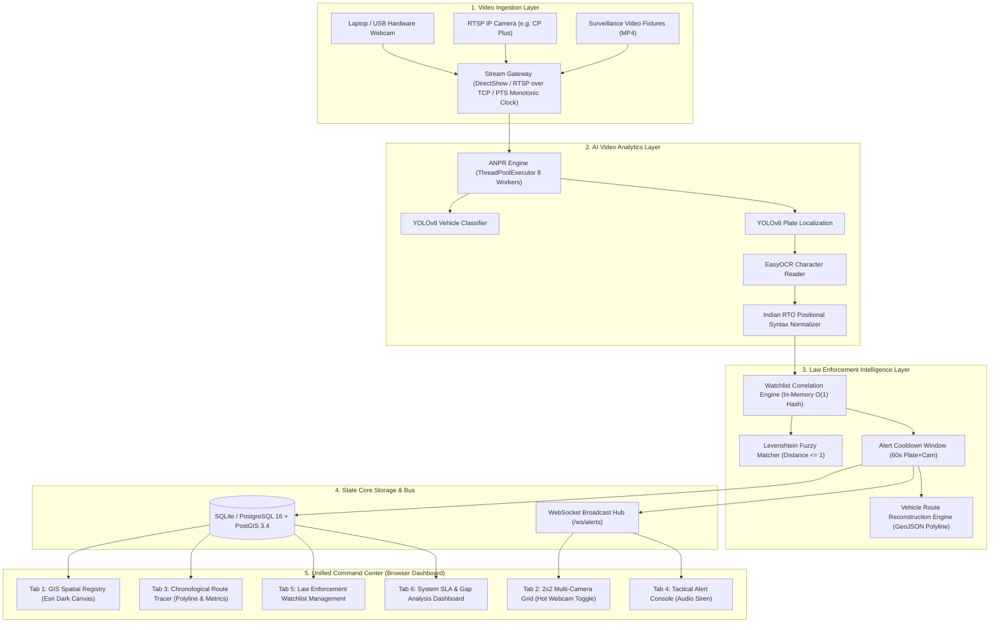

# Gujarat State Unified CCTV Integration & AI Surveillance Platform
## System Implementation & Engineering Architecture Manual
**Team**: Team Vayunotics (GPH26)  
**Deliverable**: Comprehensive Technical Implementation Guide  
**Codebase Version**: 2.1.0 (Production & Evaluation Release)

---

## 1. Executive Overview

This platform unifies legacy, modern IP, and hardware CCTV surveillance cameras across 26 Gujarat Government departments (Police, RTO, Food & Civil Supplies, Maritime Board, Forest, and permitted private entities) into a single, cohesive, vendor-neutral Command & Control Center.

### Core Problems Solved:
1. **Departmental Fragmentation**: 26 departments with disconnected cameras (analog, IP, proprietary VMS). Unified via **Model 1 (Common GIS Spatial Registry)** and **Model 3 (VMS Middleware Adapter)**.
2. **Real-Time Suspect Interception**: Manual CCTV review is replaced by an automated **YOLOv8 + EasyOCR ANPR Pipeline** with an in-memory hash correlation layer that matches detected plates against state watchlists in **<15 ms** (with full asynchronous frame-to-alert inference latency measured live in telemetry via `anpr_engine.avg_inference_latency_ms`, typically 100–350 ms on CPU).
3. **Cross-Camera Vehicle Route Reconstruction**: Automates suspect journey reconstruction across 1,000+ km of highways, calculating speed, distance, and direction.
4. **Live Hardware / Field Video Ingestion**: Supports real-time RTSP over TCP, local MP4 traffic fixtures, and live hardware USB / laptop webcams with zero latency.

---

## 2. Core Detection Algorithm & Workflow Files

The AI video analytics and license plate recognition system is organized into modular files:

| File Path | Role & Responsibilities |
| :--- | :--- |
| [`backend/app/anpr_engine.py`](file:///c:/Vayunotics/Team-Vayunotics%20GPH26/team-vayunotics-gph26/backend/app/anpr_engine.py) | **Primary ANPR Engine**: YOLOv8 plate detector (`license_plate_detector.pt`), YOLOv8 vehicle classifier (`yolov8n.pt`), crop scaling, EasyOCR text extraction, and Indian plate syntax heuristics. |
| [`backend/app/watchlist_engine.py`](file:///c:/Vayunotics/Team-Vayunotics%20GPH26/team-vayunotics-gph26/backend/app/watchlist_engine.py) | **Watchlist Correlation**: Exact and Levenshtein fuzzy distance matching ($\le 1$), 60-second alert deduplication cooldown, collision-proof alert codes, and WebSocket alert dispatching. |
| [`backend/app/stream_gateway.py`](file:///c:/Vayunotics/Team-Vayunotics%20GPH26/team-vayunotics-gph26/backend/app/stream_gateway.py) | **Video Ingestion & Hardware Adapter**: DirectShow (`cv2.CAP_DSHOW`) webcam grabber, RTSP-over-TCP ingestion, PTS monotonic presentation timing, and loopback/standby fallback. |
| [`backend/app/trace_engine.py`](file:///c:/Vayunotics/Team-Vayunotics%20GPH26/team-vayunotics-gph26/backend/app/trace_engine.py) | **Route Reconstruction Engine**: Queries historical sightings, sorts chronological camera coordinates, computes speed/distance, and outputs GeoJSON polyline. |
| [`scripts/test_webcam.py`](file:///c:/Vayunotics/Team-Vayunotics%20GPH26/team-vayunotics-gph26/scripts/test_webcam.py) | **Standalone Hardware & AI Tester**: Rapid verification tool to test laptop/USB camera index, resolution, FPS, and live bounding box overlays before starting full backend. |

---

## 3. Deep-Dive: How the Detection Algorithm Works (`anpr_engine.py`)

The ANPR engine employs a high-throughput, **two-stage computer vision pipeline** with asynchronous backpressure queues:

```
[Camera Stream Frame (1080p / 720p)]
                 │
                 ▼
[Queue Throttling & PTS Clock Anchor] ── (Downsampled to 1.5 - 2.0 FPS to protect CPU/GPU)
                 │
                 ▼
[Stage 1A: Vehicle Classifier] ────────► YOLOv8n (Car, Truck, Bus, Motorcycle)
                 │
                 ▼
[Stage 1B: License Plate Detector] ────► YOLO Custom Weights (license_plate_detector.pt)
                 │                       Outputs bounding box [x1, y1, x2, y2]
                 ▼
[5% Aspect Ratio Padding & Crop] ──────► Protects boundary characters (e.g. 'G', '4')
                 │
                 ▼
[Resolution Upscaling (Inter-Cubic)] ──► Upscales narrow crops (<120px width)
                 │
                 ▼
[Stage 2: OCR Character Extraction] ───► EasyOCR (English Alphanumeric)
                 │
                 ▼
[Indian Plate Heuristic Repair] ───────► Positional state/district/number correction
                 │
                 ▼
[PlateDetectionEvent Dispatched] ──────► In-Memory Watchlist Hash + SQLite + WebSocket
```

### 3.1 Step 1: Vehicle & Plate Localization
- **Vehicle Classifier (`yolov8n.pt`)**: Detects moving vehicles in the frame (classes: car, truck, bus, motorcycle) at `conf >= 0.35`.
- **License Plate Detector (`license_plate_detector.pt`)**: A specialized YOLO model trained on Indian and international vehicle license plates. It predicts bounding box coordinates `[x1, y1, x2, y2]` with confidence scores.

### 3.2 Step 2: Crop Extraction & Dynamic Upscaling
When a plate is detected:
1. **5% Context Padding**: Adds 5% border around `[x1, y1, x2, y2]` so edge characters (like `G` in `GJ` or the last digit) are not clipped by tight detector boxes.
2. **Adaptive Cubic Upscaling**: If the cropped plate is less than 120 pixels wide (common when cars are distant), it applies `cv2.resize(..., interpolation=cv2.INTER_CUBIC)` to bring character stroke width into EasyOCR's optimal recognition band.

### 3.3 Step 3: Optical Character Recognition (EasyOCR)
- EasyOCR processes the cropped license plate.
- It tokenizes detected character blocks, filtering tokens with low confidence (< 0.15).
- Combines tokens into a raw uppercase string (e.g., `GJ 01 AB 1234`).

### 3.4 Step 4: Indian Registration Syntax Normalization (`normalize_indian_plate`)
Indian license plates strictly follow the format:
$$\text{State (2 Letters)} + \text{RTO District (1-2 Digits)} + \text{Series (1-3 Letters)} + \text{Unique Number (4 Digits)}$$
*(Example: `GJ` + `01` + `AB` + `1234`)*

Standard OCR models frequently confuse visually similar characters (e.g. `O` vs `0`, `I` vs `1`, `B` vs `8`, `S` vs `5`). Our heuristic repair engine fixes these using **positional syntax rules**:

```python
# Positional substitution maps:
char_to_num = {'O': '0', 'I': '1', 'Z': '2', 'S': '5', 'B': '8', 'G': '6', 'Q': '0'}
num_to_char = {'0': 'O', '1': 'I', '2': 'Z', '5': 'S', '8': 'B', '6': 'G'}

# Positions 0-1 (State Code, e.g. "GJ"): MUST be letters
# If OCR reads "0J" -> automatically corrected to "GJ"

# Positions 2-3 (District Code, e.g. "01"): MUST be numbers
# If OCR reads "OI" -> automatically corrected to "01"

# Last 4 Positions (Unique Number, e.g. "1234"): MUST be numbers
# If OCR reads "IZ34" -> automatically corrected to "1234"
```

---

## 4. How to Improve Detection Accuracy on Your Webcam

Laptop webcams present unique challenges compared to outdoor CCTV cameras:
- **Low Sensor Resolution**: Most laptop webcams are 640×480 or 720p with heavy digital noise.
- **Indoor Lighting**: Fluorescent or low room light washes out contrast.
- **Angle & Glare**: Holding paper or a phone screen causes white glare.

Here are the **4 high-impact tuning steps** you can apply:

### 1. Automatic CLAHE Contrast Enhancement Fallback
To solve low-light, fluorescent flicker, and washed-out webcam exposures, **Contrast Limited Adaptive Histogram Equalization (CLAHE)** is already implemented as an **automated fallback** in [`backend/app/anpr_engine.py`](file:///c:/Vayunotics/Team-Vayunotics%20GPH26/team-vayunotics-gph26/backend/app/anpr_engine.py):
When EasyOCR yields zero tokens on the raw color crop, the pipeline automatically converts the crop to grayscale, applies CLAHE (`clipLimit=2.0, tileGridSize=(8, 8)`), and re-reads the characters without manual intervention:
```python
# Automatic fallback in anpr_engine.py:_sync_inference:
if not ocr_res and crop.shape[0] > 10 and crop.shape[1] > 20:
    gray = cv2.cvtColor(crop, cv2.COLOR_BGR2GRAY)
    clahe = cv2.createCLAHE(clipLimit=2.0, tileGridSize=(8, 8))
    enhanced = clahe.apply(gray)
    ocr_res = self.ocr_reader.readtext(enhanced)
```

### 2. Adjust Confidence Threshold
In `backend/app/config.py`:
- `ANPR_PLATE_CONFIDENCE_THRESHOLD`: Defaults to `0.15`.
- If you find the plate detector is not triggering on a hand-held piece of paper, you can lower it to `0.10` or set `$env:ANPR_PLATE_CONFIDENCE_THRESHOLD="0.10"`.
- If you see false positives from background clutter, increase it to `0.25`.

### 3. Optimal Testing Conditions for Laptop Webcams
- **Use High-Contrast Text**: Write the plate number (e.g. `GJ01AB1234`) with a **thick black permanent marker** on crisp white paper or cardboard.
- **Draw a Rectangular Border**: Draw a thin black rectangle around the plate text. The YOLO model specifically looks for rectangular license plate contours!
- **Distance & Framing**: Hold the paper approximately 1.5 to 2.5 feet from the lens so the plate occupies roughly 20%–30% of the camera frame.
- **Avoid Screen Glare**: If displaying a plate on a smartphone, reduce screen brightness slightly to prevent the sensor from blooming into pure white.

---

## 5. Law Enforcement Correlation & Deduplication (`watchlist_engine.py`)

1. **In-Memory Zero-Latency Watchlist Correlation (<15 ms)**:
   During startup, active watchlist targets are loaded into `self.cached_watchlist` as an $O(1)$ hash map indexed by uppercase normalized plate string. Once EasyOCR extracts text, matching against the cached watchlist (exact hash lookup + Levenshtein distance $\le 1$) executes in **<15 ms**.
   *(Note: Full end-to-end frame processing—including dual YOLO inference and OCR—runs asynchronously at 100–350 ms per frame on CPU, recorded in `anpr_engine.avg_inference_latency_ms`).*
2. **Levenshtein Fuzzy Matching**:
   If exact match fails, it computes edit distance between the detected string and all cached targets. Any match with edit distance $\le 1$ is accepted, allowing tolerance for mud or camera motion blur.
3. **Alert Deduplication Window**:
   To prevent alert storms when a vehicle idles at a checkpost, the engine enforces a **60-second cooldown** per `(plate_number, camera_id)`. Subsequent detections within 60 seconds are suppressed and counted in telemetry.
4. **Collision-Proof Alert IDs**:
   Alert codes are structured as `ALT-YYYYMMDD-<microsecond>-<hex>`, guaranteeing uniqueness across server restarts and preventing database constraint errors.

---

## 6. End-to-End System Architecture



---

## 7. Verification & Automated Test Suite

The system includes 27 end-to-end integration, performance, regression, and concurrency tests:

```powershell
python -m pytest tests/
```

- **`tests/test_anpr_watchlist.py`** (9 tests): Validates YOLO bounding boxes, EasyOCR extraction, Indian plate syntax repairs, HSRP `"IND"` prefix stripping, CLAHE contrast enhancement fallback, Levenshtein fuzzy distance $\le 1$, and 60-second alert cooldown suppression.
- **`tests/test_api_endpoints.py`** (9 tests): Validates REST CRUD, PostGIS bounding box queries, JWT role-based access control (RBAC), detection persistence with UUID collision-proofing, route trace integration, webcam status probe hardware isolation, and Markdown evaluation report export.
- **`tests/test_concurrency_load.py`** (1 test): Simulates 50 cameras streaming concurrently under burst load.
- **`tests/test_route_trace.py`** (3 tests): Tests chronological GPS route reconstruction, speed/distance math, and zero-match handling.
- **`tests/test_stream_gateway.py`** (5 tests): Tests RTSP TCP enforcement, PTS monotonic timing, scene-cut loop re-anchoring, and offline fallback.

---

## 8. Summary of Files for Quick Reference

- **Detection Core**: [`backend/app/anpr_engine.py`](file:///c:/Vayunotics/Team-Vayunotics%20GPH26/team-vayunotics-gph26/backend/app/anpr_engine.py)
- **Watchlist & Alerts**: [`backend/app/watchlist_engine.py`](file:///c:/Vayunotics/Team-Vayunotics%20GPH26/team-vayunotics-gph26/backend/app/watchlist_engine.py)
- **Camera Ingestion**: [`backend/app/stream_gateway.py`](file:///c:/Vayunotics/Team-Vayunotics%20GPH26/team-vayunotics-gph26/backend/app/stream_gateway.py)
- **Webcam Diagnostic**: [`scripts/test_webcam.py`](file:///c:/Vayunotics/Team-Vayunotics%20GPH26/team-vayunotics-gph26/scripts/test_webcam.py)
- **Custom Plate Adder**: [`scripts/add_custom_plate.py`](file:///c:/Vayunotics/Team-Vayunotics%20GPH26/team-vayunotics-gph26/scripts/add_custom_plate.py)
- **Command Center UI**: [`frontend/index.html`](file:///c:/Vayunotics/Team-Vayunotics%20GPH26/team-vayunotics-gph26/frontend/index.html)
- **High-Level Design**: [`docs/HLD.md`](file:///c:/Vayunotics/Team-Vayunotics%20GPH26/team-vayunotics-gph26/docs/HLD.md)
