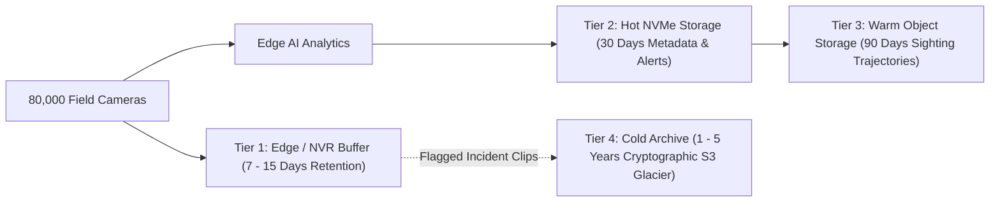

# Statewide CCTV Integration & Analytics Sizing Model
## Scalability, Bandwidth, Compute & Cost-Benefit Analysis (80,000 Cameras)
**Team**: Team Vayunotics (GPH26)  
**Target Scope**: Gujarat Statewide Surveillance Federation (26 Government Departments)  

---

## 1. Executive Sizing Summary

| Parameter | 50-Camera Hackathon Prototype | Statewide Production Target (80,000 Cameras) |
| :--- | :--- | :--- |
| **Total Cameras** | 50 Streams | ~80,000 Cameras |
| **Departments** | 6 Primary Sample Departments | 26 State Departments + Permitted Private |
| **Ingestion Protocol** | RTSP over TCP | RTSP over TCP + ONVIF Profile S/T |
| **AI Sampling Rate** | 1.5 FPS / stream | 1.0 FPS / stream (Configurable 0.5 - 2.0 FPS) |
| **Inference Ingest Load** | 75 FPS Statewide | 80,000 FPS Statewide |
| **Event Bus** | Redis Streams / Pub-Sub | Distributed Apache Kafka + Schema Registry |
| **Network Strategy** | Dual-Stream Ingest (Local/WAN) | **Metadata-First Architecture** (Edge Inference) |
| **Statewide Bandwidth** | ~100 Mbps | **~480 Mbps** (vs. 160 Gbps for raw video streaming) |
| **GPU Accelerators** | 1 Host GPU / CPU Worker Pool | **228 NVIDIA L4 GPUs** (across 6 Zonal Hubs) |
| **Database Tier** | PostgreSQL 16 + PostGIS 3.4 | Distributed PostgreSQL Citus / CockroachDB |

---

## 2. Bandwidth & Low-Bandwidth Network Strategy

### 2.1 The Centralization Trap (Why Raw Streaming Fails at Scale)
If 80,000 cameras stream raw video back to a central state command center:
$$\text{Bandwidth}_{\text{raw}} = 80,000 \times 2.0\,\text{Mbps} = 160,000\,\text{Mbps} = 160\,\text{Gbps Continuous}$$
- Over GSWAN or commercial links, 160 Gbps statewide continuous bandwidth is financially prohibitive and vulnerable to rural fiber cuts in border zones (e.g. Amirgadh, Khavda, Waghai).

### 2.2 Metadata-First Edge Ingestion (Team Vayunotics Approach)
Under our Model 3 Federation Architecture:
1. Video streams remain strictly on local edge networks (department NVRs / local switches).
2. Edge AI appliances sample frames locally at 1.0 FPS.
3. Only structured JSON telemetry (containing plate, PTS timestamp, confidence, coordinates, and a compressed 25KB license plate crop) is transmitted upstream:
   $$\text{Bandwidth}_{\text{metadata}} = 80,000 \times 1.0\,\text{FPS} \times 600\,\text{bytes} \approx 48\,\text{MB/s} \approx 384\,\text{Mbps}$$
   $$\text{Bandwidth}_{\text{crops (on hit)}} = 400 \text{ hits/sec} \times 25\,\text{KB} \approx 10\,\text{MB/s} \approx 80\,\text{Mbps}$$
   $$\text{Total Statewide Network Bandwidth} = \mathbf{464\,\text{Mbps}} \quad (\mathbf{97.1\%\text{ bandwidth reduction}})$$
4. Full high-definition video is pulled across the WAN **on-demand only** when an operator clicks a camera tile or an alert fires.

---

## 3. Compute Hierarchy & Regional Zonal Division

The State is divided into **6 Operational Zonal Hubs**:

| Zonal Hub | Geographic Jurisdiction | Camera Count | GPU Accelerators (NVIDIA L4) |
| :--- | :--- | :--- | :--- |
| **Zone 1: Ahmedabad Metro** | Ahmedabad City, Rural, Kheda, Anand | 22,000 | 63 GPUs |
| **Zone 2: Surat & South Border** | Surat, Valsad, Navsari, Tapi, Dangs | 18,000 | 52 GPUs |
| **Zone 3: Saurashtra Coastal** | Rajkot, Jamnagar, Dwarka, Somnath, Junagadh | 16,000 | 46 GPUs |
| **Zone 4: Vadodara & East Border**| Vadodara, Dahod, Panchmahal, Bharuch, Narmada | 12,000 | 34 GPUs |
| **Zone 5: Gandhinagar Capital** | Gandhinagar, Mehsana, Patan, Sabarkantha | 7,000 | 20 GPUs |
| **Zone 6: North & Kutch Border** | Banaskantha (Amirgadh), Kutch (Bhuj, Khavda) | 5,000 | 13 GPUs |
| **TOTALS** | **Entire State of Gujarat** | **80,000** | **228 GPUs** |

---

## 4. Storage Tiering & Retention Architecture

The Problem Statement notes varying retention requirements:
- **Food & Civil Supplies Department**: 7 days (local godown DVRs).
- **Transport / RTO Department**: 15 days (checkpost NVRs).
- **Home / Police Department**: 30+ days (urban command centers).

### Storage Sizing Calculation:
1. **Hot Metadata Tier (PostgreSQL + PostGIS SSD)**:
   - 80,000 cameras $\times$ 1.0 hit/sec $\times$ 500 bytes $\approx$ 40 MB/s $\approx$ 3.4 TB/day.
   - 30-day active sighting table with spatial indexing: **~102 TB NVMe SSD capacity**.
2. **Warm Trajectory Sighting Lake (MinIO / Ceph Object Store)**:
   - Compressed Parquet format: **~45 TB per month**.
3. **Cold Legal Forensic Archive (Incident Video Only)**:
   - Only flagged alerts (stolen vehicles, wanted criminals, missing persons) are archived centrally (estimated 5,000 incidents/day $\times$ 2-minute 1080p clip @ 15 MB):
     $$\text{Daily Archive Volume} = 5,000 \times 15\,\text{MB} = 75\,\text{GB/day} \approx 27.3\,\text{TB/year}$$

---

## 5. Cost-Benefit & TCO Financial Analysis (INR ₹)

### 5.1 Estimated Implementation CAPEX (One-Time)
| Component | Description | Est. Cost (INR) |
| :--- | :--- | :--- |
| **Edge Gateway Appliances** | 2,500 Modular Edge Ingest Nodes (supporting ~32 cams each) | ₹18.75 Cr |
| **Regional GPU Compute** | 228 NVIDIA L4 Enterprise Accelerators across 6 Hubs | ₹11.40 Cr |
| **Central Servers & Storage** | 150 TB NVMe SAN + 500 TB Object Storage + Backup DR | ₹6.50 Cr |
| **Software Platform & Integration** | Vayunotics Federation Platform License & Department Adapters | ₹4.80 Cr |
| **Network & Security Hardware** | HSM Cryptographic Modules, Next-Gen Firewalls, Load Balancers | ₹3.55 Cr |
| **TOTAL ESTIMATED CAPEX** | **Full Statewide 80,000 Camera Federation** | **₹45.00 Cr** |

### 5.2 Estimated Operational OPEX (Annual)
- Cloud/Data Center Hosting & Power: ₹3.20 Cr/year
- GSWAN Regional Bandwidth (Metadata Only): ₹1.80 Cr/year
- Comprehensive AMC & 24/7 Command Center Support: ₹4.50 Cr/year
- **Total Annual OPEX**: **₹9.50 Cr/year** (approximately ₹1,187 per camera per year).

### 5.3 Economic & Public Safety Return on Investment (ROI)
1. **Avoided Hardware Replacement**: Reusing existing analog/IP cameras and NVRs across 26 departments saves an estimated **₹240 Crores** in camera re-procurement costs.
2. **Bandwidth Savings**: Metadata-first architecture saves ~₹38 Crores annually in statewide leased line bandwidth charges.
3. **Crime & Revenue Impact**:
   - Immediate detection and recovery of stolen commercial vehicles and luxury cars (estimated ₹45 Crores recovered annually).
   - Deterrence of grain diversion from PDS godowns (Food & Civil Supplies) saving an estimated ₹60+ Crores annually in subsidized food grains.
   - RTO automated overload enforcement revenue increase: ~₹28 Crores annually.
